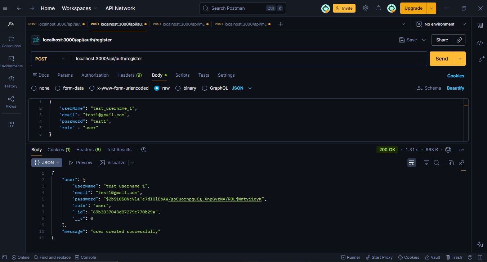
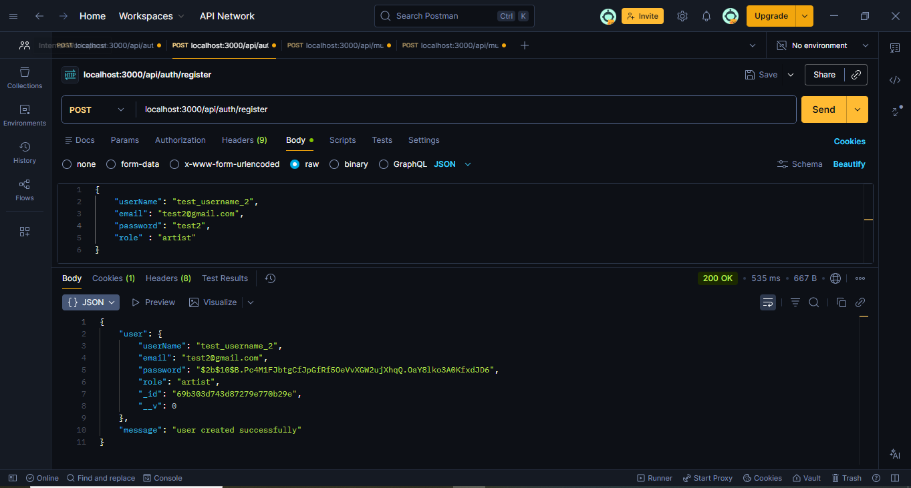
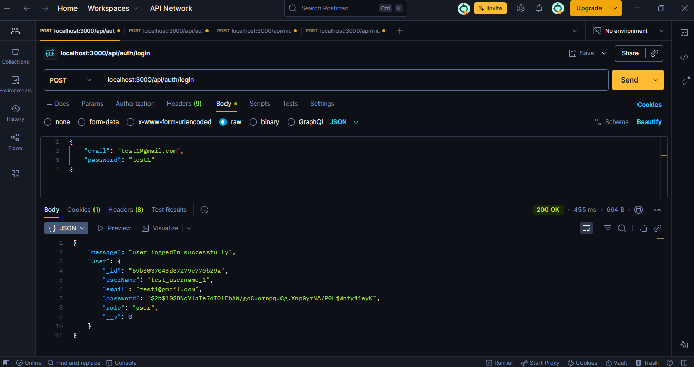
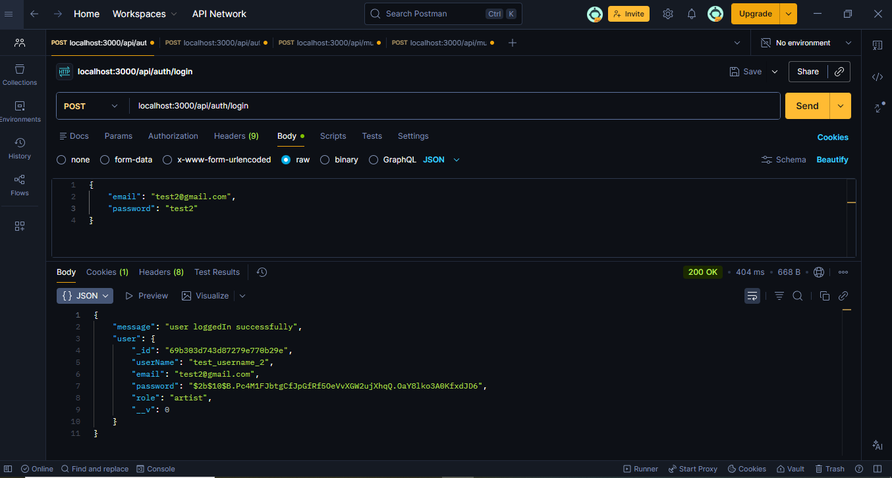
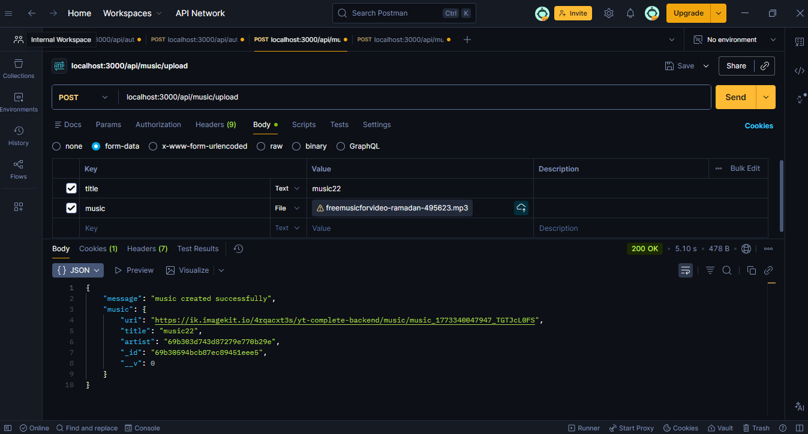
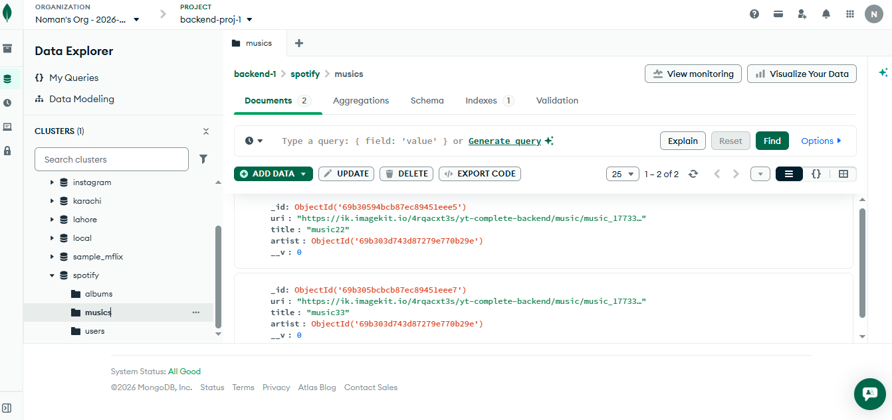
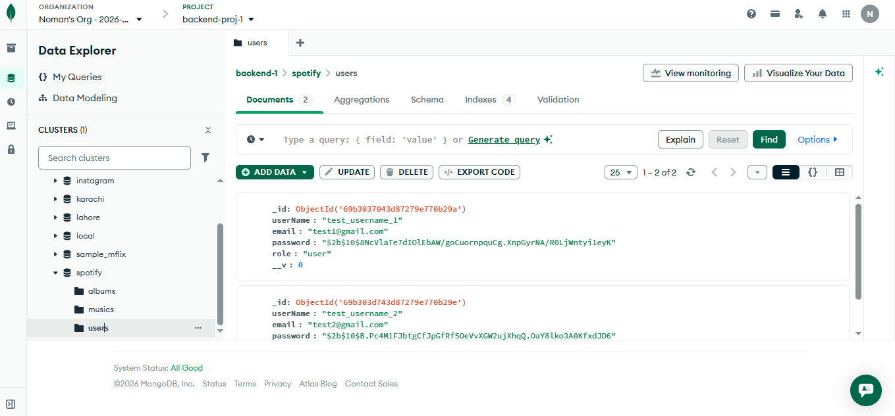

# 🎵 SPOTIFY BACKEND API

A professional backend service for a music streaming platform built with **Node.js**, **Express**, and **MongoDB**. This API allows users to register, login, and enables artists to upload tracks and create albums using automated cloud storage integration.

---

## 🚀 Features

* **Authentication & Authorization:** Secure JWT authentication stored in HTTP-only cookies.
* **RBAC (Role-Based Access Control):** Dedicated middleware to restrict music/album creation to 'Artist' roles.
* **File Management:** Integrated with **ImageKit.io** for seamless cloud storage of music files.
* **Relational Database Models:** Clean Mongoose schemas for Users, Music, and Albums with document population.
* **Secure Password Handling:** Salted hashing using **bcryptjs**.

---

## 🛠️ Tech Stack

* **Runtime:** Node.js
* **Framework:** Express.js
* **Database:** MongoDB (via Mongoose)
* **File Uploads:** Multer & ImageKit SDK
* **Security:** JWT, Bcrypt, Cookie-parser

---

## 📸 Project Previews

### API Testing (Postman)
| Feature | Screenshot |
| :--- | :--- |
| **User Registration** |  |
| **Artist Registration** |  |
| **User Login** |  |
| **Artist Login** |  |
| **Music Upload** |  |

### Database Structure
| MongoDB Collection | Preview |
| :--- | :--- |
| **User  Schemas** |  |
| **Music Schemas** |  |
---

